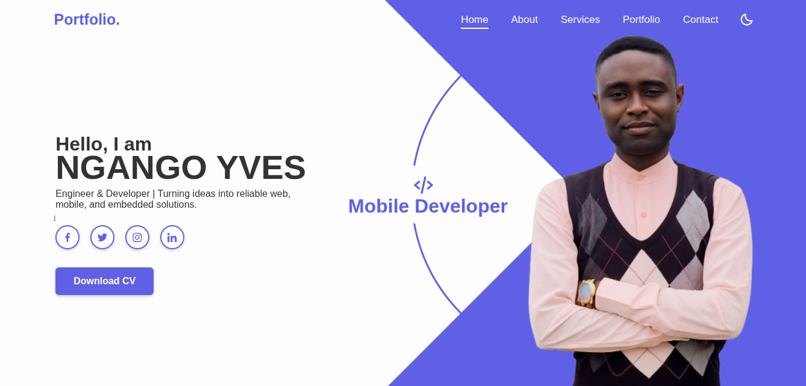
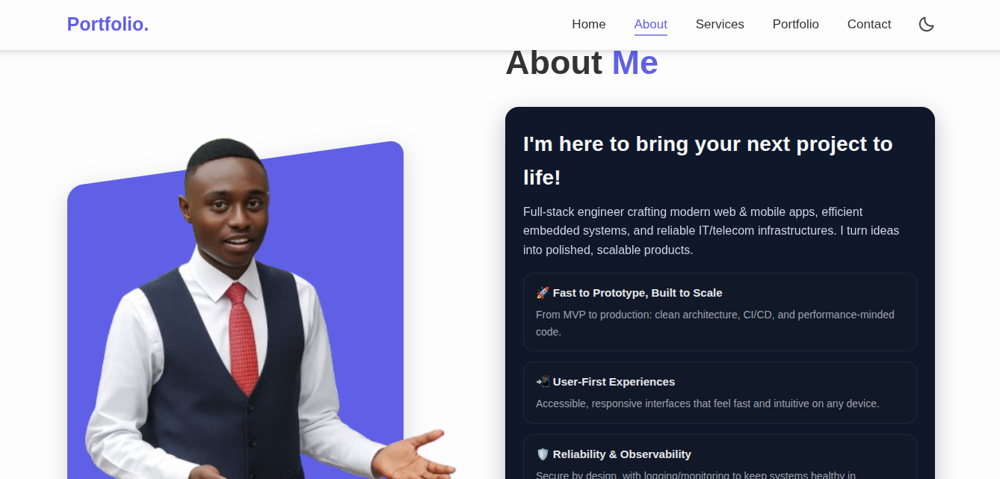
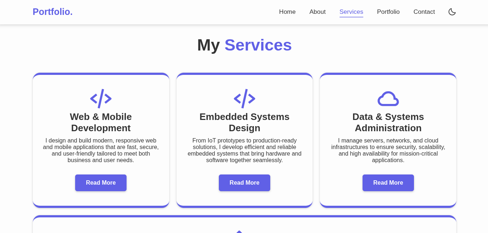
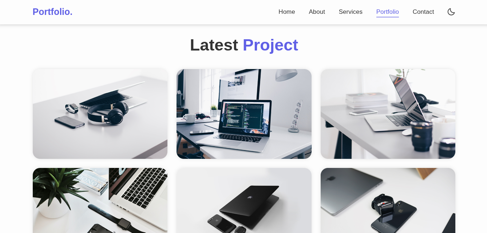

# 🌐 Developer Portfolio Website  

This is my personal **portfolio website** showcasing who I am, the services I provide, and the projects I’ve built.  
It is fully responsive, modern, and designed with clean UI/UX principles.  

👉 The projects displayed in this portfolio can be found here on my [GitHub profile](https://https://github.com/NGANGOYves/).  

---

## ✨ Features  

- Responsive and modern design  
- Dark/Light mode toggle  
- Sections: **Home, About, Services, Portfolio, Testimonials, Contact**  
- Portfolio project highlights with live previews  
- Integrated social media links  

---

## 📸 Screenshots  

Here are some previews of the portfolio:  

### 🏠 Home Section  
  

### 👤 About Section  
  

### 💼 Portfolio Section  
  

### ✉️ Contact Section  
  

---

## 🚀 Tech Stack  

- **HTML5**  
- **CSS3** (Custom + Boxicons + Swiper.js)  
- **JavaScript** (animations, interactivity, dark mode)  

---

## 📂 Projects Highlighted  

1. 🩺 **Teleconsultation App**  
2. ♻️ **Smart Waste Management**  
3. 🔐 **KYC Verification System**  
4. 🌍 **Environmental News Platform**  
5. 🎓 **School KYC System**  
6. 💻 **This Portfolio Website**  

Find the full source code for these projects on my GitHub profile.  

---

## 📬 Contact  

If you want to collaborate, build a project, or just say hi:  

- 📧 Email: yveslucas20@gmail.com 
- 💼 LinkedIn: [My LinkedIn](https://www.linkedin.com/in/ngango-yves-636209300/)  

---

### 🔗 Live Demo  

[Live Website Here](https://ngangoyves.github.io/Fullstack-Portfolio/#home)  

---

📌 *Built with ❤️ by **NGANGO YVES***  
